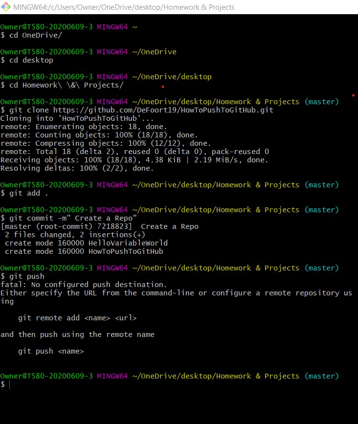

# HowToPushToGitHub
First, lets create our repository on GitHub, click new in the Repositories tab then create the name and commit after checking the "read me" box so we can add text and images later. 

Next, we want to create a folder on our desktop that will hold all of our files for this project. After that, we are going to copy the link in the above image and use the command "git clone" in GitBash to clone the new repo in your desirable folder. 

Now, you will want to add all your work to that folder before sending it all to GitHub: images, cloned repository, and your read me should all be in your folder at this point. 

Next, you will want to navigate to that folder on your command line in GitBash to go through the next commands:
git add . 
git commit -m "INSERT COMMIT MESSAGE HERE SO YOU KNOW WHAT OU UPDATED / CHANGED"
git push

Congratulations! You successfully created your first repository. :)

